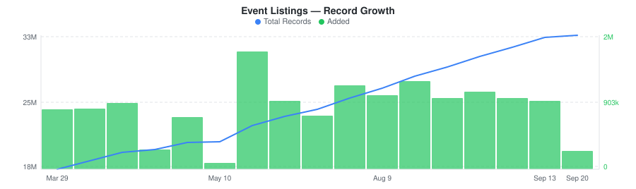
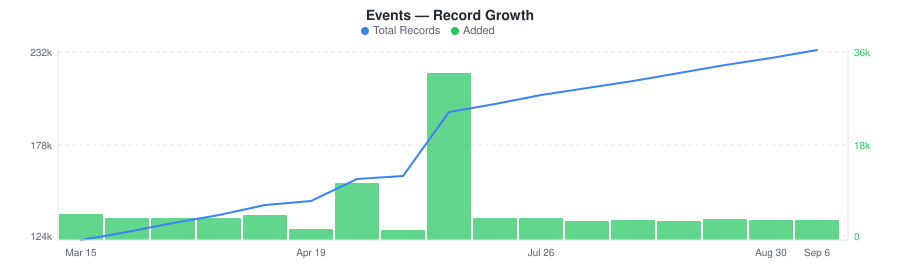
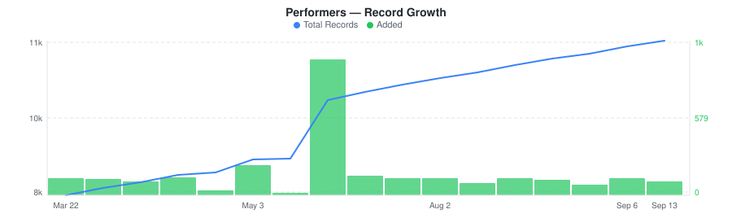
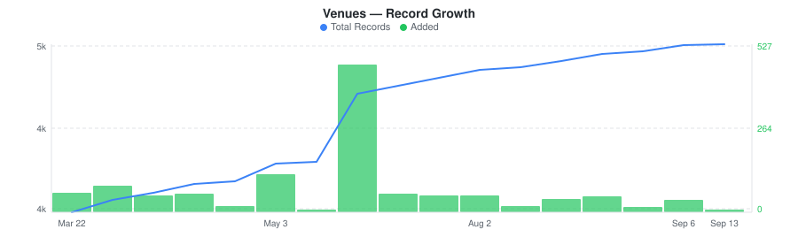

# Gametime Last-Minute Tickets & Event Listings Dataset

&nbsp;&nbsp;[](https://rebrowser.net/products/datasets/gametime)

Daily snapshots of Gametime's last-minute ticket marketplace with events, listings, deal badges, venues, and performers across sports, concerts, and theater.


This repository contains a preview sample of the [Gametime dataset](https://rebrowser.net/products/datasets/gametime) published by Rebrowser. If you're doing academic research, you may be eligible for free access to a much larger slice — see [Free Datasets for Research](https://rebrowser.net/free-datasets-for-research).


This dataset contains **4** entities, each in its own folder: Event Listings (`event-listings`), Events (`events`), Performers (`performers`), Venues (`venues`). See below for a full field breakdown, sample counts, and data distributions for each.

*Found this useful? ⭐ Star this repo to help us keep publishing fresh data. Found an error? [Let us know](https://rebrowser.net/contact-us).*


---

### Event Listings
Per-event ticket listings from Gametime with section, row, seat group, delivery type, transfer type, ticket type, deal badges, available lot sizes, and ticket disclosures.


> **20,848,978** total records from 2025-11-16 to 2026-05-10, **up to 30,000** rows in this sample (0.14% of full dataset).
> Exported as one file per day, up to 1,000 rows each, last 30 days retained.



| Field | Type | Fill Rate | Description |
| --- | --- | --- | --- |
| `_primaryKey` | `string` | 100% | Unique identifier for this record |
| `_firstSeenAt` | `datetime` | 100% | First time this record was seen |
| `_lastSeenAt` | `datetime` | 100% | Last time this record was updated |
| `listingId` | `string` | 100% | Unique listing ID (e.g., 6908fe8a9c1370439bc948a4) |
| `eventId` | `string` | 100% | Event ID this listing belongs to (join with gametime_events) |
| `pricePrefee` 🔒 | `float` | 100% | Ticket price in cents before fees |
| `priceTotal` 🔒 | `float` | 100% | Total ticket price in cents (with fees) |
| `priceFaceValue` 🔒 | `float` | 56% | Face value of ticket in cents (original printed price) |
| `salesTax` 🔒 | `float` | 100% | Sales tax amount in cents |
| `preTaxTotal` 🔒 | `float` | 100% | Pre-tax total price in cents |
| `availableLots` | `array` | 100% | Available ticket quantities (e.g., [1,2,3,4] means you can buy 1, 2, 3, or 4 tickets) |
| `section` | `string` | 100% | Venue section number/name (e.g., 317, 106, 438) |
| `row` | `string` | 100% | Row within section (e.g., 8, 3, GA) |
| `sectionGroup` | `string` | 83% | Section group/tier (e.g., Club Corner, Lower Corner, Upper, Dream Seat) |
| `seats` | `array` | 100% | Seat numbers (* indicates unassigned/GA) |
| `deliveryType` | `string` | 100% | Ticket delivery method (mobile, electronic, direct, hard, instant) |
| `transferType` | `string` | 75% | Ticket transfer type (tm, paciolan, sg, axs, mlb, text) |
| `ticketType` | `string` | 100% | Ticket type (tmqr, tm, tm-web, tdc, gtlew, url, tm-official) |
| `deal` | `string` | 32% | Deal indicator (great, amazing, cheapest, super, zone) |
| `savingsAmount` 🔒 | `float` | 100% | Displayed savings amount in cents |
| `savingsPercent` 🔒 | `float` | 100% | Displayed savings percentage |
| `disclosures` | `array` | 3% | Ticket disclosures (club_access, first_row, aisle, limited_view, standing_room, zone_deal, etc.) |
| `inHandDate` | `datetime` | 83% | Date when tickets will be in hand for delivery |
| `eventName` | `string` | — | Event name (from events table) |
| `eventCategory` | `string` | — | Event category (from events table) |
| `eventDatetimeUtc` | `datetime` | — | Event datetime UTC (from events table) |
| `eventVenueId` | `string` | — | Event venue ID (from events table) |


> 🔒 **Premium fields** are included in the data files but their values are replaced with `[PREMIUM]`. To access real values, [use our website](https://rebrowser.net/products/datasets/gametime).


#### Field Distributions


<details>
<summary><strong>Deal Badge Distribution</strong> (<code>deal</code>)</summary>


| Value | Count | Share |
| --- | --- | --- |
| great | 2,915,615 | `█████████░░░░░░░░░░░` 43.9% |
| amazing | 2,367,383 | `███████░░░░░░░░░░░░░` 35.6% |
| cheapest | 879,527 | `███░░░░░░░░░░░░░░░░░` 13.2% |
| super | 466,069 | `█░░░░░░░░░░░░░░░░░░░` 7.0% |
| zone | 18,371 | `░░░░░░░░░░░░░░░░░░░░` 0.3% |

</details>


---

### Events
Gametime events with category, local/UTC datetime, deal indicators, venue and performer references across sports, music, theater, and comedy.


> **160,407** total records from 2025-11-16 to 2026-05-10, **up to 30,000** rows in this sample (18.7% of full dataset).
> Exported as one file per day, up to 1,000 rows each, last 30 days retained.



| Field | Type | Fill Rate | Description |
| --- | --- | --- | --- |
| `_primaryKey` | `string` | 100% | Unique identifier for this record |
| `_firstSeenAt` | `datetime` | 100% | First time this record was seen |
| `_lastSeenAt` | `datetime` | 100% | Last time this record was updated |
| `eventId` | `string` | 100% | Unique event ID (e.g., 672a9e0be4da09717f007c8b) |
| `name` | `string` | 100% | Event name/title (e.g., Daniel O Donnell, Elf The Musical) |
| `category` | `string` | 100% | Event category (music, theater, sports) |
| `datetimeLocal` | `datetime` | 100% | Event local datetime |
| `datetimeUtc` | `datetime` | 100% | Event UTC datetime |
| `salesCutOff` | `datetime` | 100% | Sales cutoff datetime (when ticket sales end) |
| `tbd` | `bool` | 100% | Event is TBD (to be determined) |
| `timeTbd` | `bool` | 100% | Event time is TBD |
| `dateTbd` | `bool` | 100% | Event date is TBD |
| `minPriceTotal` 🔒 | `float` | 100% | Minimum ticket price in cents (total with fees) |
| `minPricePrefee` 🔒 | `float` | 100% | Minimum ticket price in cents (before fees) |
| `maxPriceTotal` 🔒 | `float` | 100% | Maximum ticket price in cents (total with fees) |
| `maxPricePrefee` 🔒 | `float` | 100% | Maximum ticket price in cents (before fees) |
| `zoneDealPriceTotal` 🔒 | `float` | 100% | Zone deal price in cents (total) |
| `flashDealPriceTotal` 🔒 | `float` | 100% | Flash deal price in cents (total) |
| `hasExclusives` | `bool` | 100% | Event has exclusive listings |
| `mapless` | `bool` | 100% | Event has no seat map |
| `venueId` | `string` | 100% | Venue ID (join with gametime_venues for details) |
| `performerIds` | `array` | 100% | Performer IDs (join with gametime_performers for details) |
| `popularityScore` 🔒 | `float` | 100% | Event popularity score |
| `trendingScore` 🔒 | `float` | 98% | Event trending score |


> 🔒 **Premium fields** are included in the data files but their values are replaced with `[PREMIUM]`. To access real values, [use our website](https://rebrowser.net/products/datasets/gametime).


#### Field Distributions


<details>
<summary><strong>Event Categories</strong> (<code>category</code>)</summary>


| Value | Count | Share |
| --- | --- | --- |
| music | 55,472 | `████████░░░░░░░░░░░░` 38.2% |
| theater | 42,925 | `██████░░░░░░░░░░░░░░` 29.6% |
| comedy | 21,289 | `███░░░░░░░░░░░░░░░░░` 14.7% |
| milb | 8,653 | `█░░░░░░░░░░░░░░░░░░░` 6.0% |
| cbb | 3,913 | `█░░░░░░░░░░░░░░░░░░░` 2.7% |
| wcbb | 3,098 | `░░░░░░░░░░░░░░░░░░░░` 2.1% |
| other | 2,758 | `░░░░░░░░░░░░░░░░░░░░` 1.9% |
| cbs | 2,617 | `░░░░░░░░░░░░░░░░░░░░` 1.8% |
| mlb | 2,264 | `░░░░░░░░░░░░░░░░░░░░` 1.6% |
| echl | 2,048 | `░░░░░░░░░░░░░░░░░░░░` 1.4% |

</details>


---

### Performers
Gametime performers with name, abbreviation, slug, category, category group, primary genre, and genre tags across sports teams, music artists, theater acts, and comedy.


> **9,147** total records from 2025-11-16 to 2026-05-10, **1,000** rows in this sample (10.9% of full dataset).
> Exported as a single file, overwritten daily.



| Field | Type | Fill Rate | Description |
| --- | --- | --- | --- |
| `_primaryKey` | `string` | 100% | Unique identifier for this record |
| `_firstSeenAt` | `datetime` | 100% | First time this record was seen |
| `_lastSeenAt` | `datetime` | 100% | Last time this record was updated |
| `performerId` | `string` | 100% | Unique performer ID (e.g., 59dbed9825f2c567c037f20b) |
| `name` | `string` | 100% | Performer full name (e.g., Sam Smith) |
| `shortName` | `string` | 100% | Performer short name (e.g., Sam Smith) |
| `mediumName` | `string` | 100% | Performer medium name (e.g., Sam Smith) |
| `abbrev` | `string` | 100% | Performer abbreviation (e.g., SMITH) |
| `slug` | `string` | 100% | URL-friendly performer slug (e.g., musicsamsmith) |
| `category` | `string` | 100% | Performer category (e.g., music, sports) |
| `categoryGroup` | `string` | 100% | Category group (e.g., concert, nfl, nba) |
| `primaryGenre` | `string` | 62% | Primary genre slug (e.g., pop) |
| `genres` | `array` | 63% | Array of genre slugs (e.g., pop, rock) |
| `primaryColor` | `string` | 100% | Primary brand color hex (e.g., 637079FF) |
| `heroImageUrl` 🔒 | `string` | 100% | Hero image URL |
| `headerImageUrl` 🔒 | `string` | 100% | Header image URL |
| `logoImageUrl` 🔒 | `string` | 100% | Logo image URL |


> 🔒 **Premium fields** are included in the data files but their values are replaced with `[PREMIUM]`. To access real values, [use our website](https://rebrowser.net/products/datasets/gametime).


#### Field Distributions


<details>
<summary><strong>Performer Categories</strong> (<code>category</code>)</summary>


| Value | Count | Share |
| --- | --- | --- |
| music | 4,603 | `████████████░░░░░░░░` 58.9% |
| comedy | 770 | `██░░░░░░░░░░░░░░░░░░` 9.9% |
| cbb | 550 | `█░░░░░░░░░░░░░░░░░░░` 7.0% |
| wcbb | 457 | `█░░░░░░░░░░░░░░░░░░░` 5.9% |
| theater | 403 | `█░░░░░░░░░░░░░░░░░░░` 5.2% |
| cbs | 304 | `█░░░░░░░░░░░░░░░░░░░` 3.9% |
| cfb | 224 | `█░░░░░░░░░░░░░░░░░░░` 2.9% |
| milb | 182 | `░░░░░░░░░░░░░░░░░░░░` 2.3% |
| csoft | 163 | `░░░░░░░░░░░░░░░░░░░░` 2.1% |
| soccer | 154 | `░░░░░░░░░░░░░░░░░░░░` 2.0% |

</details>


---

### Venues
Gametime venues with name, city, state, metro area, timezone, geo-coordinates, and full street address across the US.


> **4,117** total records from 2025-11-16 to 2026-05-10, **1,000** rows in this sample (24.3% of full dataset).
> Exported as a single file, overwritten daily.



| Field | Type | Fill Rate | Description |
| --- | --- | --- | --- |
| `_primaryKey` | `string` | 100% | Unique identifier for this record |
| `_firstSeenAt` | `datetime` | 100% | First time this record was seen |
| `_lastSeenAt` | `datetime` | 100% | Last time this record was updated |
| `venueId` | `string` | 100% | Unique venue ID (e.g., 61fc67e3b1776e00011716d3) |
| `name` | `string` | 100% | Venue name (e.g., New Orleans Fairgrounds) |
| `slug` | `string` | 100% | URL-friendly venue slug (e.g., new_orleans_fairgrounds) |
| `city` | `string` | 100% | City name (e.g., New Orleans) |
| `state` | `string` | 97% | State abbreviation (e.g., LA) |
| `metro` | `string` | 100% | Metro area identifier (e.g., neworleans) |
| `timezone` | `string` | 100% | IANA timezone (e.g., America/Chicago) |
| `latitude` | `float` | 100% | Venue latitude coordinate |
| `longitude` | `float` | 100% | Venue longitude coordinate |
| `addressCountryCode` | `string` | 100% | Address country code (e.g., US) |
| `addressCity` | `string` | 100% | Address city (e.g., New Orleans) |
| `addressState` | `string` | 97% | Address state (e.g., LA) |
| `addressPostalCode` | `string` | 100% | Address postal/ZIP code (e.g., 70116) |
| `addressStreet` | `string` | 100% | Street address (e.g., 1751 Gentilly Boulevard) |
| `addressExtended` | `string` | 96% | Extended address (e.g., New Orleans, LA 70116) |
| `imageUrl` 🔒 | `string` | 100% | Venue image URL |


> 🔒 **Premium fields** are included in the data files but their values are replaced with `[PREMIUM]`. To access real values, [use our website](https://rebrowser.net/products/datasets/gametime).


#### Field Distributions


<details>
<summary><strong>Venues by State</strong> (<code>state</code>)</summary>


| Value | Count | Share |
| --- | --- | --- |
| CA | 421 | `████░░░░░░░░░░░░░░░░` 22.4% |
| TX | 271 | `███░░░░░░░░░░░░░░░░░` 14.4% |
| NY | 252 | `███░░░░░░░░░░░░░░░░░` 13.4% |
| FL | 195 | `██░░░░░░░░░░░░░░░░░░` 10.4% |
| OH | 142 | `██░░░░░░░░░░░░░░░░░░` 7.5% |
| IL | 142 | `██░░░░░░░░░░░░░░░░░░` 7.5% |
| PA | 136 | `█░░░░░░░░░░░░░░░░░░░` 7.2% |
| NC | 120 | `█░░░░░░░░░░░░░░░░░░░` 6.4% |
| NV | 109 | `█░░░░░░░░░░░░░░░░░░░` 5.8% |
| CO | 93 | `█░░░░░░░░░░░░░░░░░░░` 4.9% |

</details>


---

## Pre-built Views on Rebrowser

Rebrowser web viewer lets you filter, sort, and export any slice of this dataset interactively. These pre-built views are ready to open:


### Event Listings


[Listings with Deal Badge](https://rebrowser.net/products/datasets/gametime/event-listings/views/listings-with-deal) — 6,646,965 records

↳ `[{"field":"deal","op":"isNotEmpty"},{"sort":"priceTotal ASC"}]`

[Instant Delivery Listings](https://rebrowser.net/products/datasets/gametime/event-listings/views/listings-instant-delivery) — 66,196 records

↳ `[{"field":"deliveryType","op":"is","value":"instant"},{"sort":"priceTotal ASC"}]`

[Listings with Savings](https://rebrowser.net/products/datasets/gametime/event-listings/views/listings-with-savings) — 20,848,978 records

↳ `[{"field":"savingsAmount","op":"gt","value":0},{"sort":"savingsPercent DESC"}]`

[Cheapest Deal Listings](https://rebrowser.net/products/datasets/gametime/event-listings/views/listings-cheapest-deal) — 879,527 records

↳ `[{"field":"deal","op":"is","value":"cheapest"},{"sort":"priceTotal ASC"}]`

[Listings by Price (Low to High)](https://rebrowser.net/products/datasets/gametime/event-listings/views/listings-by-price) — 20,848,978 records

↳ `[{"sort":"priceTotal ASC"}]`


*[See all 18 views →](https://rebrowser.net/products/datasets/gametime/event-listings)*


### Events


[Events with Flash Deals](https://rebrowser.net/products/datasets/gametime/events/views/events-with-flash-deals) — 160,407 records

↳ `[{"field":"flashDealPriceTotal","op":"gt","value":0},{"sort":"datetimeUtc ASC"}]`

[NBA Events](https://rebrowser.net/products/datasets/gametime/events/views/nba-events) — 1,418 records

↳ `[{"field":"category","op":"is","value":"nba"},{"sort":"datetimeUtc ASC"}]`

[Music & Concert Events](https://rebrowser.net/products/datasets/gametime/events/views/gametime-music-events) — 55,472 records

↳ `[{"field":"category","op":"is","value":"music"},{"sort":"datetimeUtc ASC"}]`

[Events with Zone Deals](https://rebrowser.net/products/datasets/gametime/events/views/events-with-zone-deals) — 160,407 records

↳ `[{"field":"zoneDealPriceTotal","op":"gt","value":0},{"sort":"datetimeUtc ASC"}]`

[Events with Exclusive Listings](https://rebrowser.net/products/datasets/gametime/events/views/events-with-exclusives) — 38,865 records

↳ `[{"field":"hasExclusives","op":"isTrue","value":true},{"sort":"datetimeUtc ASC"}]`


*[See all 19 views →](https://rebrowser.net/products/datasets/gametime/events)*


### Performers


[Music Performers](https://rebrowser.net/products/datasets/gametime/performers/views/music-performers) — 4,603 records

↳ `[{"field":"category","op":"is","value":"music"},{"sort":"name ASC"}]`

[College Basketball Performers](https://rebrowser.net/products/datasets/gametime/performers/views/cbb-performers) — 550 records

↳ `[{"field":"category","op":"is","value":"cbb"},{"sort":"name ASC"}]`

[Theater Performers](https://rebrowser.net/products/datasets/gametime/performers/views/theater-performers) — 403 records

↳ `[{"field":"category","op":"is","value":"theater"},{"sort":"name ASC"}]`

[NBA Performers](https://rebrowser.net/products/datasets/gametime/performers/views/nba-performers) — 38 records

↳ `[{"field":"category","op":"is","value":"nba"},{"sort":"name ASC"}]`

[NFL Performers](https://rebrowser.net/products/datasets/gametime/performers/views/nfl-performers) — 37 records

↳ `[{"field":"category","op":"is","value":"nfl"},{"sort":"name ASC"}]`


*[See all 17 views →](https://rebrowser.net/products/datasets/gametime/performers)*


### Venues


[Venues in California](https://rebrowser.net/products/datasets/gametime/venues/views/venues-california) — 421 records

↳ `[{"field":"state","op":"is","value":"CA"},{"sort":"name ASC"}]`

[Venues in Texas](https://rebrowser.net/products/datasets/gametime/venues/views/venues-texas) — 271 records

↳ `[{"field":"state","op":"is","value":"TX"},{"sort":"name ASC"}]`

[Venues in New York](https://rebrowser.net/products/datasets/gametime/venues/views/venues-new-york) — 252 records

↳ `[{"field":"state","op":"is","value":"NY"},{"sort":"name ASC"}]`

[Venues in Florida](https://rebrowser.net/products/datasets/gametime/venues/views/venues-florida) — 195 records

↳ `[{"field":"state","op":"is","value":"FL"},{"sort":"name ASC"}]`

[Venues in Illinois](https://rebrowser.net/products/datasets/gametime/venues/views/venues-illinois) — 142 records

↳ `[{"field":"state","op":"is","value":"IL"},{"sort":"name ASC"}]`


*[See all 19 views →](https://rebrowser.net/products/datasets/gametime/venues)*


---

## Code Examples

```python
import pandas as pd
from pathlib import Path

# ── Venues (reference table) ────────────────────────────────────────────────
venues = pd.read_parquet('rebrowser/gametime-dataset/venues/data.parquet')

# Top 10 states by venue count
print(venues['state'].value_counts().head(10).to_string())

# Venues in a specific metro area
print(venues[venues['metro'] == 'newyork'][['name', 'city', 'state']]
      .to_string(index=False))

# ── Performers (reference table) ────────────────────────────────────────────
performers = pd.read_parquet('rebrowser/gametime-dataset/performers/data.parquet')

# Count performers by category (nba, nfl, music, theater, etc.)
print(performers['category'].value_counts().head(15).to_string())

# Music performers with a primary genre
music = performers[(performers['category'] == 'music') & (performers['primaryGenre'].notna())]
print(music.groupby('primaryGenre').size().sort_values(ascending=False).head(10).to_string())

# ── Events (daily files) ────────────────────────────────────────────────────
files = sorted(Path('rebrowser/gametime-dataset/events/data').glob('*.parquet'))[-7:]
events = pd.concat([pd.read_parquet(f) for f in files])

# Events per category
print(events['category'].value_counts().to_string())

# Upcoming confirmed events (date not TBD)
confirmed = events[events['dateTbd'] == False].sort_values('datetimeUtc')
print(confirmed[['name', 'category', 'datetimeUtc']].head(20).to_string(index=False))

# ── Event Listings (daily files) ────────────────────────────────────────────
files = sorted(Path('rebrowser/gametime-dataset/event-listings/data').glob('*.parquet'))[-7:]
listings = pd.concat([pd.read_parquet(f) for f in files])

# Deal badge distribution
print(listings['deal'].value_counts().to_string())

# Listings by delivery type
print(listings['deliveryType'].value_counts().to_string())
```

---

## Use Cases


### Last-Minute Pricing Analysis

Study how deal badges (great, amazing, cheapest, super, zone) distribute across event categories and delivery types. Identify which sports and concert segments see the most deal activity.


### Venue Market Mapping

Map venue density by state and metro area using geo-coordinates. Identify which regions have the highest event concentration and compare venue coverage across markets.


### Performer Demand Research

Analyze which performer categories and genres generate the most events. Track how leagues like NFL, NBA, and MLB compare in event volume over time.


### Delivery & Inventory Patterns

Examine distribution of ticket delivery types (mobile, electronic, instant, direct) and available lot sizes across event categories to understand marketplace fulfillment dynamics.


---

## Full Dataset on Rebrowser


This repo is a 1,000-row preview sample. The full dataset is at [rebrowser.net/products/datasets/gametime](https://rebrowser.net/products/datasets/gametime)

Doing academic research? You may qualify for free access to a larger slice. See [Free Datasets for Research](https://rebrowser.net/free-datasets-for-research).

On Rebrowser you can:
- **Filter before you buy** — use the web UI to apply filters on any field and sort by any column. Preview results before purchasing. You only pay for records that match your criteria.
- **Export in your format** — CSV, JSON, JSONL, or Parquet depending on your plan.
- **Access via API** — integrate dataset queries into your pipelines and workflows.
- **Choose your freshness** — plans range from a 14-day lag to real-time data with no delay.
- **Select only the fields you need** — keep exports lean. Premium fields with richer data are available on higher plans.

[Pricing](https://rebrowser.net/pricing) starts at **$2 per 1,000 rows** with volume discounts.

---

## License & Terms

**Free for research and non-commercial use** with attribution. See [license terms](https://rebrowser.net/free-datasets-for-research#license) and [how to cite](https://rebrowser.net/free-datasets-for-research#citation).

```bibtex
@misc{rebrowser_gametime,
  author       = {Rebrowser},
  title        = {Gametime Last-Minute Tickets & Event Listings Dataset},
  year         = {2026},
  howpublished = {\url{https://rebrowser.net/products/datasets/gametime}},
  note         = {Accessed: YYYY-MM-DD}
}
```

Commercial use requires a paid license — see [pricing](https://rebrowser.net/pricing). Use of this data is governed by the [Rebrowser Terms of Use](https://rebrowser.net/terms-of-use), which may be updated at any time independently of this repository.

---

## Disclaimer

Rebrowser is an independent data provider and is not affiliated with, endorsed by, or sponsored by Gametime. Any trademarks are the property of their respective owners. This dataset is compiled from publicly available information; we do not request or collect Gametime user credentials. By using this dataset, you agree to comply with Gametime's Terms of Service and all applicable laws and regulations. Images, logos, descriptions, and other materials included in this dataset remain the intellectual property of their respective owners and are provided solely for informational purposes. Rebrowser makes no warranties regarding the accuracy, completeness, or legality of the data and assumes no liability for how the data is used. You are solely responsible for ensuring that your use of this dataset does not infringe on the rights of any third party.


You can also find this data on [Kaggle](https://www.kaggle.com/datasets/rebrowser/gametime-dataset), [HuggingFace](https://huggingface.co/datasets/rebrowser/gametime-dataset), [Zenodo](https://doi.org/10.5281/zenodo.18854576).


